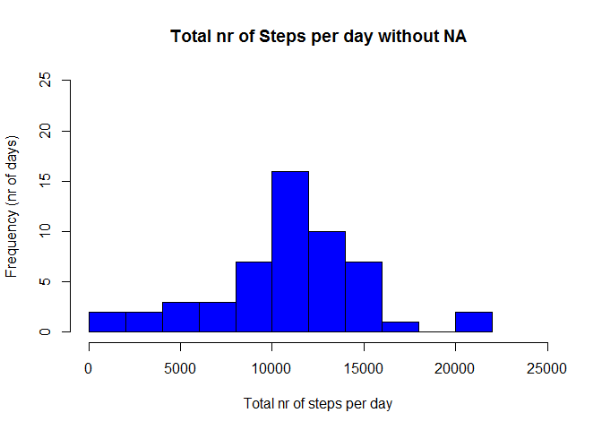

# Reproducible Research: Peer Assessment 1


## Loading and preprocessing the data
Load Data

```r
library(lattice)
library(knitr)
data=read.csv("H:/Courses/DataScience/RR/RepData_PeerAssessment1/activity.csv", header = TRUE )
summary(data)
```

```
##      steps                date          interval     
##  Min.   :  0.00   2012-10-01:  288   Min.   :   0.0  
##  1st Qu.:  0.00   2012-10-02:  288   1st Qu.: 588.8  
##  Median :  0.00   2012-10-03:  288   Median :1177.5  
##  Mean   : 37.38   2012-10-04:  288   Mean   :1177.5  
##  3rd Qu.: 12.00   2012-10-05:  288   3rd Qu.:1766.2  
##  Max.   :806.00   2012-10-06:  288   Max.   :2355.0  
##  NA's   :2304     (Other)   :15840
```

Process/Transform data

- We need to remove incomplete rows from the dataset.


```r
data2 = data
data2_without_NA <-data2[complete.cases(data2),]
NA_num <- nrow(data2) - nrow(data2_without_NA)
```

- To calculate the minimum and maximum date we need to convert to "Data" type.  


```r
min_date <- min(as.Date(data2$date)) 
max_date <- max(as.Date(data2$date))
tcd <-as.numeric(max_date- min_date) +1
```

## What is mean total number of steps taken per day?
Calculate nr of steps per day

```r
tsd_day <-as.data.frame(tapply(data2_without_NA$steps, INDEX = data2_without_NA$date, FUN = "sum", na.rm = TRUE))
colnames(tsd_day)<-"steps"
tsd_day$date <- as.Date(rownames(tsd_day))
tsd_day$steps <- as.integer(tsd_day$steps)
```

Draw the histogram with frequency of total number of steps per day


```r
hist(tsd_day$steps, main = "Total nr of Steps per day without NA", xlab = "Total nr of steps per day", ylab = "Frequency (nr of days)", breaks = 10, xlim = c(0,25000), ylim = c(0,25), col = "blue")
```

 

Calculate mean and median

```r
mean_without_NA <- mean(tsd_day$steps, na.rm = TRUE)
median_without_NA <- median(tsd_day$steps, na.rm = TRUE)
```

With missing values removed the mean for total number of steps per day is  1.0766189\times 10^{4}.

With missing values removed the median for total number of steps per day is  10765.


## What is the average daily activity pattern?


## Imputing missing values

```r
NA_num <- nrow(data2) - nrow(data2_without_NA)
```
A. There are 2304 NA recs out of 17568 total recs.


## Are there differences in activity patterns between weekdays and weekends?
